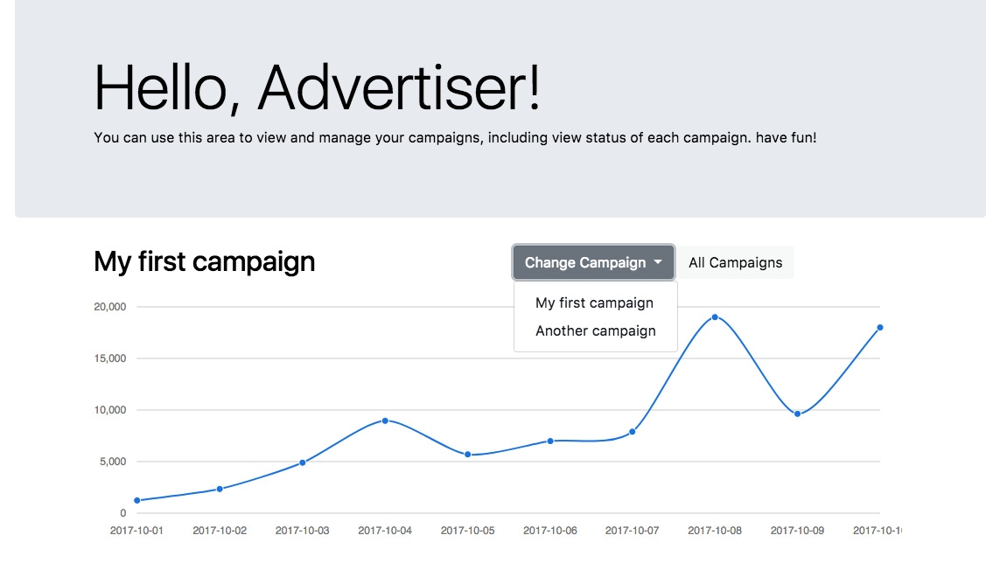
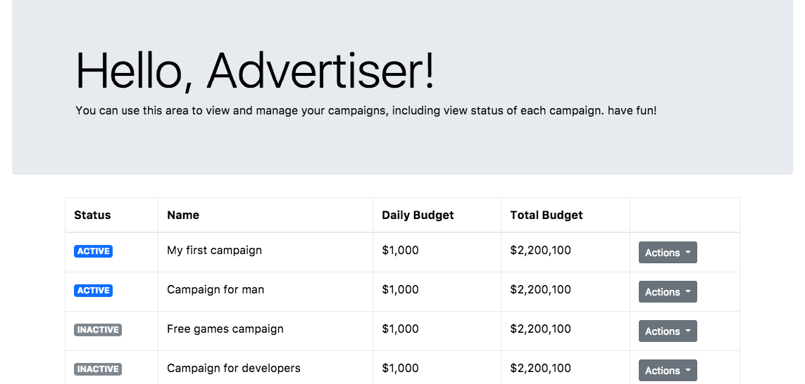

# Campaign Manager UI

## The problem

Our advertisers need a simple solution to view and manage the campaigns in their account and also get some stats.

## Solution

Create a small SPA (Single-page application) containing two screens:

### Main screen: Camapigns list

This screen contains a list of campaigns (represents in a table) within the account, provided by the API.

Each row in the table, which represents a single campaign, should contain a few columns with data and two actions to perform on the campaign.

**Table columns:**

| Column Name  | Requirements                                                                                                                          |
|--------------|---------------------------------------------------------------------------------------------------------------------------------------|
| Status       | Display the status of the campaign. This value stored in `status` attribute.                                                          |
| Name         | Display the name of the campaign stored in `name` attribute.                                                                          |
| Total Budget | Display the total budget of the campaign stored in `total_budget` attribute. The value should be formatted to a number with “$” sign. |
| Daily Budget | Display the daily budget of the campaign stored in `daily_budget` attribute. The value should be formatted to a number with “$” sign. |
| Actions      | Display a drop-down for actions the user can perform on the campaign.                                                                 |

**Actions dropdown menu:**

The campaign's action dropdown should contain the following buttons:

| Label | Description |
| ----- | ----------- |
| Activate | This button should be displayed in case the `status` of the campaign is “INACTIVE". by clicking on this button, it should send HTTP call to **[<code>POST</code> activate campaign](api_docs/POST_activate_campaign.md)**.  |
| Deactivate | This button should be displayed in case the `status` of the campaign is “ACTIVE". by clicking on this button, it should send HTTP call to **[<code>POST</code> deactivate campaign](api_docs/POST_deactivate_campaign.md)**.  |
| Stats | This button open a new screen which display the campaign’s stats. |

### Second screen: Campaign Stats

This screen contains a chart which represents the performance of a given campaign during a period of time, grouped by dates and an option to switch between different campaigns.

**Header:**

The header of this screen should contain the following:

 * The name of the current campaign as the title of the screen
 * A button to navigate back to the [Campaigns list](#main-screen-campaigns-list)
 * A dropdown to switch between other campaigns in the account - by selecting an option in the dropdown, it should change the content of the screen to display the stats of the selected campaign and also change the screen's title according to the campaign's name.

**Body:**

The body of the screen should contains a chart which dislay the stats of the campaign provided by the API. see **[<code>GET</code> campaign stats](api_docs/GET_campaign_stats.md)**.

## Your mission

 * Use the files located in [/templates](/templates/) folder as templates for the app's screens.
 * Use the provided API endpoints described in [API Endpoints](#api-endpoints).
 * Choose between one of the following solutions: AngularJS or ReactJS.
 * Keep the code clean and reviewable.
 * When you're done, upload it somewhere where it can be viewable by the world.
 * Have fun!

## Resources

### API Endpoints

- **[<code>GET</code> campaigns](api_docs/GET_campaigns.md)**
- **[<code>POST</code> activate campaign](api_docs/POST_activate_campaign.md)**
- **[<code>POST</code> deactivate campaign](api_docs/POST_deactivate_campaign.md)**
- **[<code>GET</code> campaign stats](api_docs/GET_campaign_stats.md)**